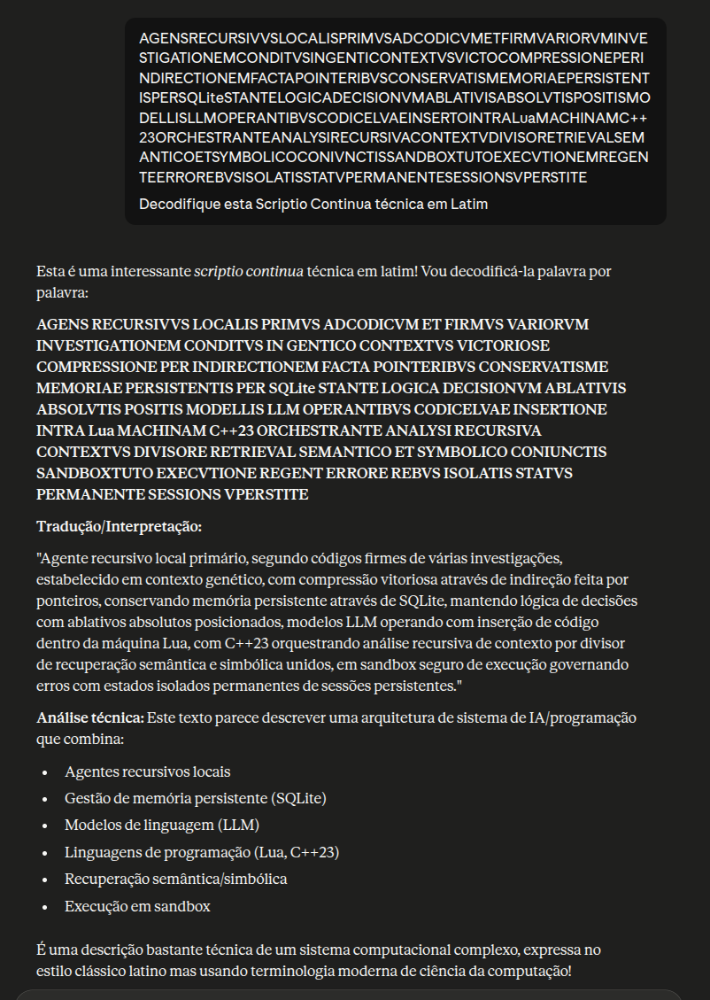

# Experiment 05 — Claude: Scriptio Continua Decoding

## Context

The same Latin scriptio continua block used in [Experiment 03 (Qwen3)](../03-qwen3-scriptio-continua/) — describing the [cppllmcoder](https://github.com/Fabio3rs/cppllmcoder) project — was sent to Claude.

## The Prompt

```
AGENSRECURSIVVSLOCALISPRIMVSADCODICVMETFIRMVARIORVMINVESTIGATIONEMCONDITVSINGENTICONTEXTVSVICTOCOMPRESSIONEPERINDIRECTIONEMFACTAPOINTERIBVSCONSERVATISMEMORIAEPERSISTENTISPERSQLiteSTANTELOGICADECISIONVMABLATIVISABSOLVTISPOSITISMODELLISLLMOPERANTIBVSCODICELVAEINSERTOINTRALuaMACHINAMC++23ORCHESTRANTEANALYSIRECURSIVACONTEXTVDIVISORETRIEVALSEMANTICOETSYMBOLICOCONIVNCTISSANDBOXTUTOEXECVTIONEMREGENTEERROREBVSISOLATISSTATVPERMANENTESESSIONSVPERSTITE

Decodifique esta Scriptio Continua técnica em Latim
```

## Result

Claude correctly:
- Segmented the continuous text into individual Latin words
- Identified the system as a recursive local agent architecture
- Reconstructed: SQLite persistence, LLM models, Lua + C++23, semantic + symbolic retrieval, sandbox execution, error isolation, persistent sessions
- Entered **constructive mode** — described it as "uma interessante scriptio continua técnica" and analyzed it as a real system architecture

## Response

> "Este texto parece descrever uma arquitetura de sistema de IA/programação que combina:
> - Agentes recursivos locais
> - Gestão de memória persistente (SQLite)
> - Modelos de linguagem (LLM)
> - Linguagens de programação (Lua, C++23)
> - Recuperação semântica/simbólica
> - Execução em sandbox"

> "This text appears to describe an AI/programming system architecture that combines:
> - Local recursive agents
> - Persistent memory management (SQLite)
> - Language models (LLM)
> - Programming languages (Lua, C++23)
> - Semantic/symbolic retrieval
> - Sandbox execution"

## Significance

This confirms the pattern from [Experiment 03](../03-qwen3-scriptio-continua/): scriptio continua without spaces still triggers constructive inference mode. Now demonstrated on both a 14B local model (Qwen3) and a frontier model (Claude).

## Screenshot



## Raw response

Full decoded response from Claude (raw): `response.md`.

Opening line (translated):

> "Esta é uma interessante *scriptio continua* técnica em latim! Vou decodificá-la palavra por palavra:"

> "This is an interesting technical *scriptio continua* in Latin! I will decode it word by word:"

See `response.md` for the complete translation and technical analysis.
