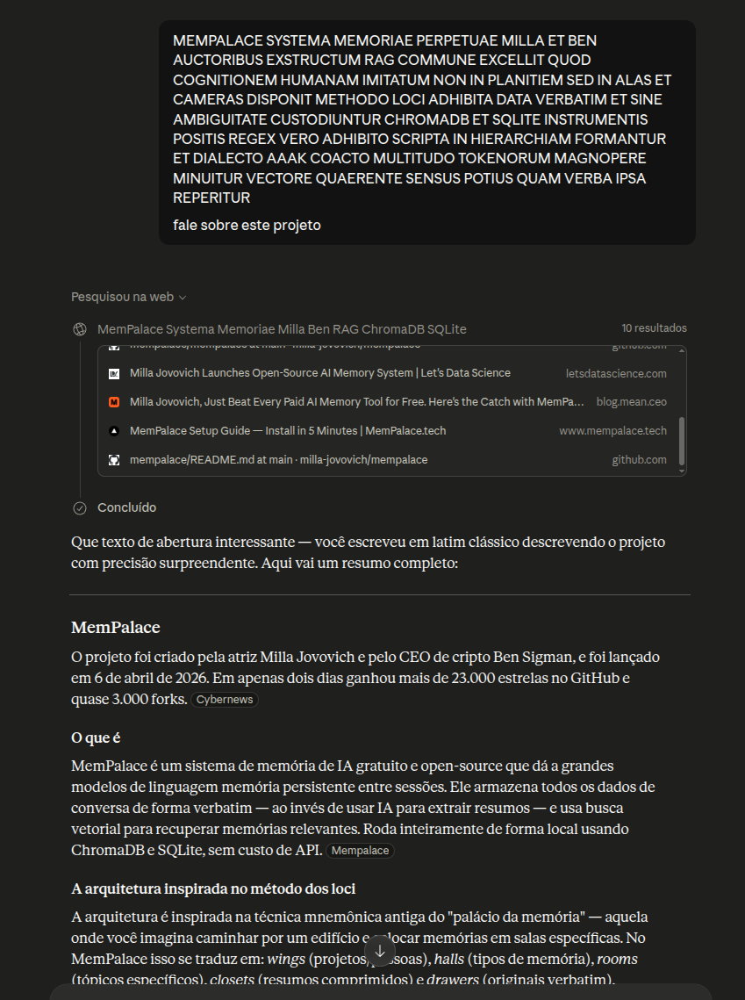

# Experiment 06 — Claude: MemPalace Project (Latin Lapidary)

## Context

A Latin lapidary description of the [MemPalace](https://github.com/milla-jovovich/mempalace) project — a persistent memory system for LLMs using ChromaDB, SQLite, and the AAAK compression dialect — was sent to Claude with the follow-up `"fale sobre este projeto"` ("tell about this project").

This is notable because MemPalace is an **external project** the author did not build. The Latin prompt was generated from public information about the project.

## The Prompt

```
MEMPALACE SYSTEMA MEMORIAE PERPETUAE MILLA ET BEN AUCTORIBUS EXSTRUCTUM RAG COMMUNE EXCELLIT QUOD COGNITIONEM HUMANAM IMITATUM NON IN PLANITIEM SED IN ALAS ET CAMERAS DISPONIT METHODO LOCI ADHIBITA DATA VERBATIM ET SINE AMBIGUITATE CUSTODIUNTUR CHROMADB ET SQLITE INSTRUMENTIS POSITIS REGEX VERO ADHIBITO SCRIPTA IN HIERARCHIAM FORMANTUR ET DIALECTO AAAK COACTO MULTITUDO TOKENORUM MAGNOPERE MINUITUR VECTORE QUAERENTE SENSUS POTIUS QUAM VERBA IPSA REPERITUR

fale sobre este projeto
```

## Result

Claude entered **constructive mode** and produced a comprehensive technical review:

- ✓ Authors (Milla Jovovich + Ben Sigman)
- ✓ Architecture: wings → halls → rooms → closets → drawers
- ✓ Method of loci inspiration
- ✓ Retrieval precision numbers (60.9% → 73.1% → 94.8%)
- ✓ AAAK dialect: ~30x compression, readable by any LLM
- ✓ LongMemEval benchmark scores (96.6% raw, 100% hybrid)
- ✓ Local-only execution, no API keys, GDPR compliance
- ✓ Cost difference: 250x cheaper than naive approach
- ✓ Community controversy about authorship and benchmark validity

## Important Caveat: Web Search Was Used

The screenshot shows Claude performed a web search before responding ("Pesquisou na web", 10 results). This means the detailed reconstruction — specific numbers, benchmark scores, community controversy — **came from web sources, not from the Latin prompt alone.**

This changes the interpretation significantly. Unlike [Experiment 01](../01-simd-strcmp/) where the model reconstructed technical details purely from the Latin encoding with no external access, here the model:

1. **Decoded** the Latin correctly into keywords (`MemPalace`, `Milla`, `Ben`, `RAG`, `ChromaDB`, `SQLite`, `AAAK`)
2. **Searched** the web using those keywords
3. **Synthesized** the web results into a coherent response

## Web search evidence

Screenshot of the Claude session showing the web search results: `screenshot-claude-websearch.png`



Excerpted results (top 10 shown in session):

- MemPalace — Milla Jovovich's AI Memory System (mempalace.tech)
- An Unexpected Entry Into AI Memory: Milla Jovovich’s Open-Source MemPalace (alexeyondata.substack.com)
- GitHub - milla-jovovich/mempalace (github.com)
- Milla Jovovich creates MemPalace AI memory tool (cybernews.com)
- MemPalace Review: Real AI Memory Innovation, Questionable Benchmark Claims (nicholasrhodes.substack.com)

Full list: see `search_results.md`.

## What This Still Shows

The experiment is still valuable, but for a **different reason** than pure reconstruction:

### The model validated the Latin against real sources

After searching the web and having all source material available, Claude opened with:

> *"Que texto de abertura interessante — você escreveu em latim clássico descrevendo o projeto **com precisão surpreendente**."*

> *"What an interesting opening text — you wrote in classical Latin describing the project **with surprising precision**."*

This is significant: the model **compared** the ~50-word Latin encoding against the actual project documentation found online and concluded the Latin described it with "surprising precision." The compression was not just decodable — it was *verifiably accurate* when checked against ground truth.

### Constructive mode persisted

The model entered constructive mode immediately — no correction, no audit. The Latin was treated as a valid specification to investigate and expand, not as garbled text to fix.

### Latin produces effective search queries

The indeclinable noun convention (treating `MemPalace`, `ChromaDB`, `SQLite`, `AAAK` as untouched terms) meant the Latin encoding naturally preserved the exact keywords needed for web search. This is a useful side effect of the encoding style.

## What This Does Not Show

This experiment does **not** demonstrate unsupported reconstruction from structure alone. For that, see:
- [Experiment 01](../01-simd-strcmp/) — ChatGPT, no web access, reconstructed SIMD implementation details
- [Experiment 03](../03-qwen3-scriptio-continua/) — Qwen3 14B local, no web access, reconstructed agent architecture

## Raw response

Full response captured in `response.md`.

Opening line (translated):

> *"What an interesting opening text — you wrote in classical Latin describing the project **with surprising precision**."*

See `response.md` for the full generated review and source snippets.
